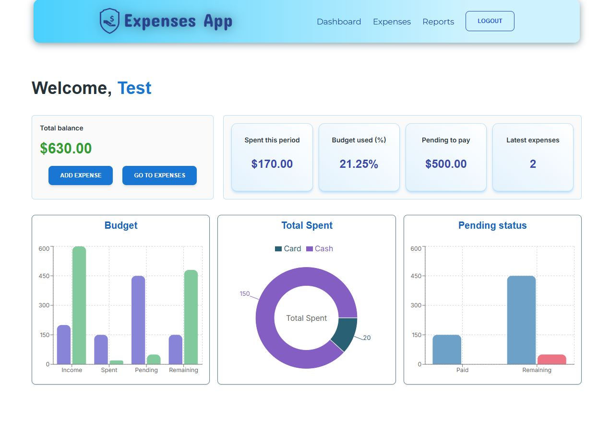
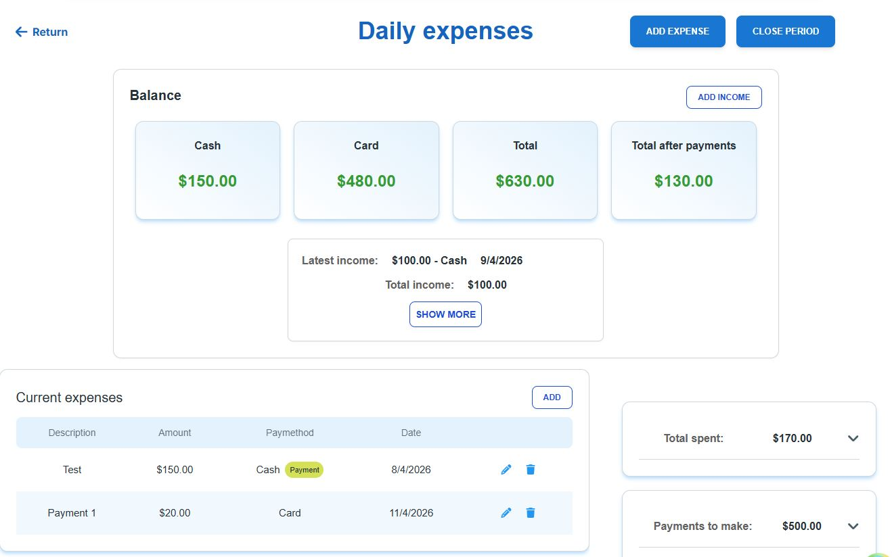
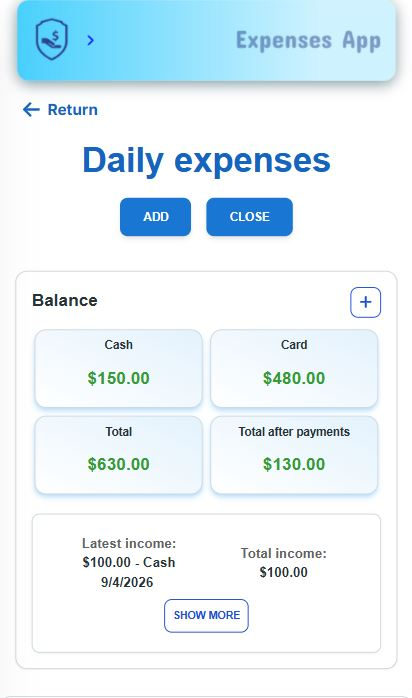
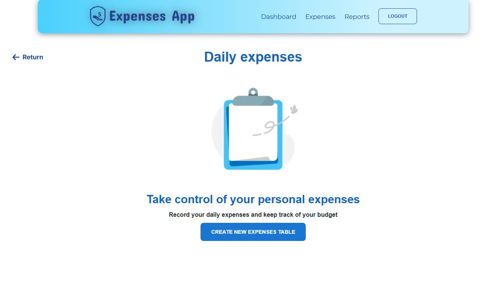

# Expenses App

A full-stack personal finance tracker built with Next.js 14, focused on budget control across cash and card payment methods. Track expenses, manage pending payments, and visualize your financial period at a glance.

**Live demo:** https://expenses-app-2.vercel.app

> Demo credentials available on request, or sign in with Google.

---

## Screenshots

### Dashboard


### Expenses Table — Desktop


### Expenses Table — Mobile


### Empty State


---

## Features

- **Period-based budgeting** — create an expenses table for a time period, set cash and card income separately, close it when done
- **Expense tracking** — add, edit, and delete expenses with payment method tagging (cash or card)
- **Pending payments** — track upcoming financial commitments separately from recorded expenses; link expenses to pending items as payments are made
- **Budget visualization** — dashboard charts showing income vs spent vs pending vs remaining, cash/card split, and pending fulfillment status
- **Quick actions** — add an expense directly from the dashboard without navigating to the expenses module
- **Authentication** — credentials-based login and Google OAuth; JWT sessions with 7-day expiration
- **Accessibility** — zero errors on WAVE and axe audits

---

## Tech Stack

| Layer | Technology |
|---|---|
| Framework | Next.js 14 (App Router) |
| Language | TypeScript |
| Database | MongoDB (direct connection, no ORM) |
| Auth | NextAuth v4 — JWT strategy, credentials + Google OAuth |
| Server state | TanStack Query v5 |
| Forms | React Hook Form v7 |
| Charts | Recharts |
| Styling | Tailwind CSS + Material Tailwind |
| Testing | Jest + Testing Library |
| Deployment | Vercel |

---

## Architecture

### Hybrid rendering
Pages are server-rendered for SEO and authentication. If no valid session is found, the user is redirected to login server-side before any client code runs. Data fetching and mutations are handled client-side with TanStack Query.

### MongoDB embedded document pattern
Each active expense period lives as a single document per user. Expenses and pending payments are stored as embedded arrays within that document, a deliberate choice for a small-scale app that avoids the overhead of relational joins while keeping all period data co-located.

### Thin API routes
Business logic lives in pure server functions. API routes handle only HTTP concerns: authentication, input validation, DB connection, and response formatting. This keeps core logic independently testable without HTTP overhead.

### TanStack Query without optimistic updates
Mutations update the cache using `setQueryData` with the actual server response rather than optimistic updates. The server owns all financial calculations: totals, remaining balances, pending fulfillment, so the client never speculates on state.

### Security
API routes never trust client-sent table IDs. The active expenses table is always resolved server-side using `session.user.email + status: 'active'`, preventing users from accessing or modifying other users' data.

---

## Data Model

```typescript
// Active expenses table (one document per user per period)
{
  user_id: string,           // session email
  status: 'active' | 'closed',
  income: { cash: number, card: number },
  sDate: number,             // period start timestamp
  fDate: number,             // period end timestamp
  totals: {
    total_expenses: { cash: number, card: number },
    total_pending: { cash: number, card: number },
    total_payments_made: { cash: number, card: number }
  },
  pending: PendingExpenseI[],
  expenses: ExpenseItemI[],
  remaining: { cash: number, card: number }
}
```

---

## Testing

79 unit tests across 16 suites covering core business logic, input validation, and data mutations. Pure server functions are tested directly without HTTP layer overhead.

```bash
npm run test
```

---

## Running locally

```bash
# Install dependencies
npm install

# Set up environment variables
cp .env.example .env.local
# Fill in: MONGODB_URI, NEXTAUTH_SECRET, NEXTAUTH_URL,
#          GOOGLE_CLIENT_ID, GOOGLE_CLIENT_SECRET

# Run development server
npm run dev
```

---

## Roadmap

- [x] Reports module — historical closed periods with filtering
- [ ] Accounts module
- [ ] Password reset flow
- [ ] GitHub OAuth

---

## Contibutions 🙏
- No Data Vectors by Vecteezy [Vecteezy](https://www.vecteezy.com/free-vector/no-data)

## License

- MIT
